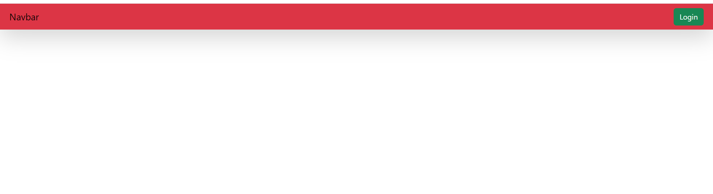

# It is contains three app in this project

# 1.table data-
Table data is use for only create model and display the data in webpage.
data entered through admin panel
cmd-python manage.py createsuperuser
http://127.0.0.1:8000/admin/

and command line throgh
cmd-python manage.py shell

1.
2.

# 2.Tablephoto-
Table data is use for display the data with image in webpage.
* media file setting in project inside settings.py
* static file  stting in project inside the urls.py

# 3.Tableforms-
Table forms is use for the register the data throgh forms.

# 4.Tablecrud-
Table Crud is use for the apply the crud operations.
with the help of frontedpage form throgh data register in admin side.

## Table ka data fronted ke throgh insert karna with apply Register.html
[[table me data ko register karwana,delete,update,Tabledata display]]

1.model create karke form ke throgh data server pe send karna.
  sath hi sath us data ko webpage pe display karana.

2.Model create karke fronted ke throgh data ko server pe send karna.
  sath hi sath us data ko webpage pe display karna.

--------------------------------------------------------------
# Some Concept about django.

Custom User model

vs

Abstract User model

# two types of class available in django model

1.AbstractUser  model

ans-Abstract user model me hamlog build model me aur kuch khud se data add kar sakte hai.

Example-

Abstract User modle me Django ki field apko milegi hi sath hi sath apni bhi field add kar sakte hai.

phoneno----------ye add kiya hai new data in model

first_name---ye sab build data hai jo django khud built kar ke deta hai  model me.

last_name

2.AbstractBaseUser model

ans-Ap apne hisab se field create kar sakte hai apko bilkul bhi django built field nahi chahiye

    to isko hamlog abastractBase User model kahte hai.

Example-

from django.contrib.auth.models import AbstractUser

class CustomUser(AbstractUser):

phone_number = models.Charfield(max_lenght=100, unique=True)

user_bio = models.Charfield(max_lenth=50)

email= moels.EmailField(unique=True)

##########################################
# Create AbstractUser  model (using Default table in django)

appname- login_register

functionality -login, register, logout

------------------------------------------

